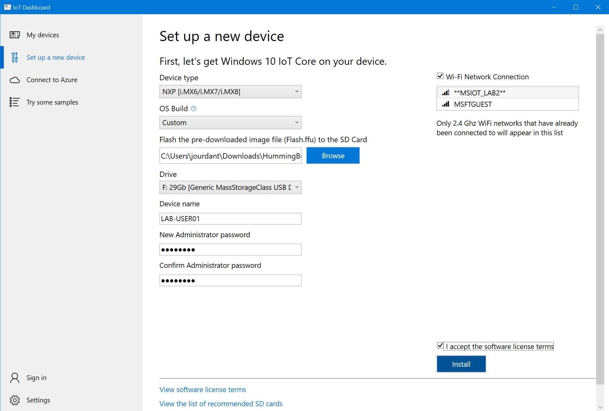

# Lab 01 - Getting started with development on Windows 10 IoT Core with Arrow Dragonboard 410c

This lab covers setting up Windows 10 IoT Core on an Arrow Dragonboard 410 and deploying apps using Visual Studio.

## Pre-requisites
### Hardware
* Arrow Dragonboard 410c
* Grove LED
* Grove Mini PIR Sensor
* 

### Software
* Visual Studio 2019 Community Edition (or above)

## 1 - Installing Windows 10 IoT Core with IoT Dashboard

Devices running Windows 10 IoT Core can be installed and configured using the IoT Dashboard. This tool makes it simple to get started and also provision Azure connectivity.

### 1.1 - Installing IoT Dashboard

1. Open a browser window to: [http://go.microsoft.com/fwlink/?LinkID=708576](http://go.microsoft.com/fwlink/?LinkID=708576)
1. Launch the IoT Dashboard and verify the application starts correctly

### 1.1 - Installing Windows 10 IoT Core

1. Connect Dragonboard to host PC with a Micro-USB cable
1. Hold down the 'Volume Up (+)' button while plugging in the power adapter into the Dragonboard
1. Open IoT Dashboard and click 'Setup a new device'
1. Change the device type to 'Qualcomm \[Dragonboard 410c\]' and set the OS Build to 'Windows 10 IoT Core (17763)'
1. Accept the license agreement and click 'Download and Install'

### 1.2 - Validating your install

1. Once the Dragonboard has completed installing, a line entry will show in the IoT Dashboard as above
2. Right click on your device and select 'Device Portal'
3. In your browser enter the default username and password:

|Name    |Value|
|--------|-----|
|Username|Administrator|
|Password|p@ssw0rd|

4. Enter a name in the 'Change your device name' text box and click 'Save'. Your device should reboot and display the new name 

## 2 - Deploying apps to Dragonboard

### 2.1 - Hello world
1. Open up the first lab project found in [C:\Labs\Lab01\Dragonboard.sln](file:///C:\Labs\Lab01\Dragonboard.sln) 
1. Update the target system architecture to say 'ARM' as shown in the image below

1. Change target system from 'Local' to 'Remote Machine' and enter the IP address of your device. This can be found on the screen of your device

### 2.2 - Adding an output

### 2.3 - Adding an input

## 3 - Publishing your app

etc.