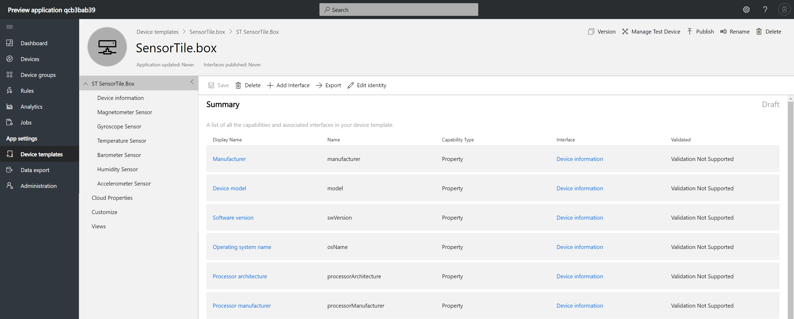
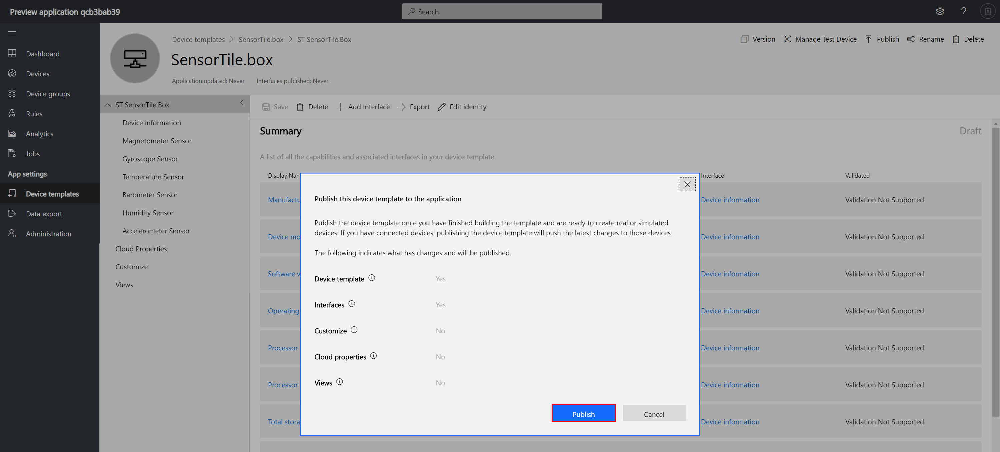
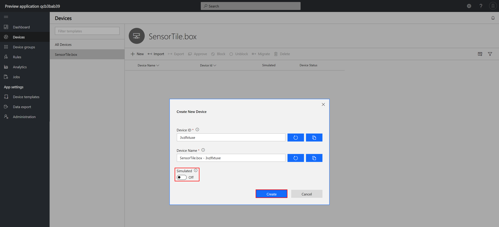
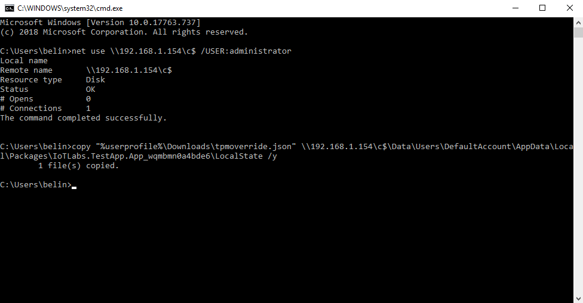

# Lab 02 - Integrating Windows 10 IoT with Azure IoT Central
This lab covers setting up Azure IoT Central, creating a Device Template and adding your HummingBoard as a device. By the end of this Lab you should be able to monitor your HummingBoard device in the cloud.

## Pre-requisites

### Software
* Web Browser

## 1 - Deploying Azure IoT Central (IOTC)

### 1.1 - Create IOTC application

1. Navigate to [apps.azureiotcentral.com](https://apps.azureiotcentral.com) and log in with supplied lab credentials

2. Click **New Application**, and choose the following settings:

|Name    |Value|
|--------|-----|
|Payment Plan|Pay-as-you-go|
|Application Template|Preview Application|
|Application Name|[choose a name]|
|Subscription|MSIoTLabs-IIA (or bring your own)|
|Region|Central US|

3. Click **Create** to provision your application


### 1.2 - Create Device Template

1. Navigate to Device Templates and click **New**


1. IoT Central can import existing Device Templates from the [Azure IoT Device Catalog](), however we are creating our own device. Click **Custom**.


1. Name your Device Template **SensorTile.box**, press Return and then click **Import Capability Model**.


1. Browse to the `C:\Labs\Content\src\Azure.IoTCentral\` folder and upload the file named `ST SensorTile.Box.json`.


1. Click **Views** and click **Generate Default Views**, change nothing on the sceen and click **Generate Default Views** again.


1. Click **Publish** (found at the top right) and confirm the process by clicking **Publish** again.


### 1.3 - Create Device from Template

1. Click **Devices**, choose your newly created Device Template and click **New**.


2. Confirm that the **Simulated** toggle is **unchecked**, then click **Create**.

3. Click on your new device to see the device dashboard. There should be no data showing yet.


4. Click the **Connect** button and record the `Scope ID`, `Device ID` and `Primary Key`. These are the Azure IoT Hub Device Provisioning Service (DPS) details. You will need these to set up your device.


## 2 - Configure device to connect to IoT Central

### 2.1 - Prepare Azure IoT Hub Device Details
1. Open a browser tab and navigate to [www.dpsgen.com/iia](https://www.dpsgen.com/iia).

2. Enter the `Scope ID`, `Device ID` and `Primary Key` collected earlier and click **Generate JSON**. 

3. Open a Command Prompt as Administrator.
4. Replace the IP address in each of the following two commands with the IP Address of your HummingBoard device, then run the two commands in your command prompt window; one command after the other:
```batch
net use \\<device ip address here>\c$ /USER:administrator
copy "%userprofile%\Downloads\tpmoverride.json" \\<device ip address here>\c$\Data\Users\DefaultAccount\AppData\Local\Packages\IoTLabs.TestApp.App_wqmbmn0a4bde6\LocalState /y
```


5. Manually restart the HummingBoard device (you may need to connect a mouse to the device and then choose the Settings cog in the bottom left corner. In the drop-down list that shows at the top left under App Settings, choose **Power Options** and click on the **Restart** button). Once started you should see Azure IoT now showing as connected.


6. Switching back to IoT Central, you should be able to see data in the dashboard as well.


