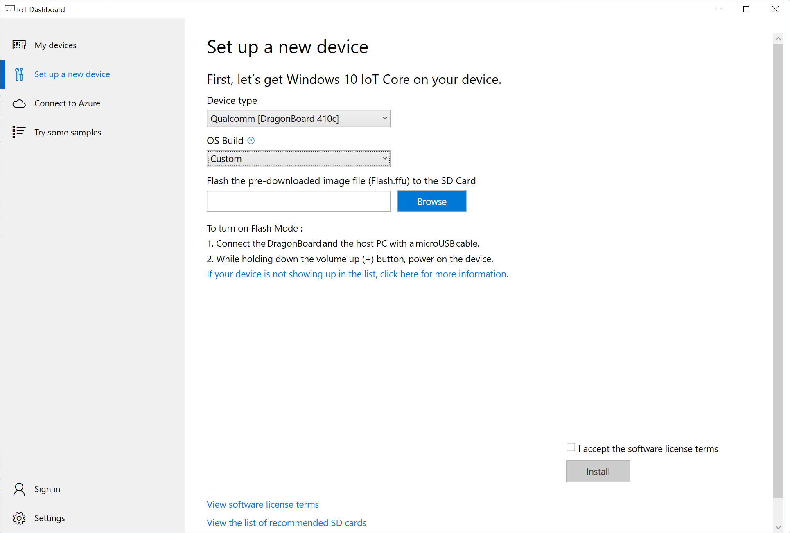

# Lab 03 - Creating a custom Windows IoT FFU

## Pre-requisites
### Hardware
* Arrow Dragonboard 410c
* Grove LED
* Grove Button

### Software
* Visual Studio 2019 Community Edition (or above)
* Dragonboard 410c - BSP Package
* Windows Assessment and Deployment KiT (Windows ADK)
* Windows 10 IoT Core packages
* IoT Core ADK Add-Ons
* IoT Core PowerShell environment
* Dragonboard update tool

## 1 - Build your image

### 1.1 - Create your workspace

Microsoft enables device manufacturers and OEMs to design their own IoT Core images. These images are built using an IoT Workspace and customized using Board Support Packages (BSPs) containing drivers, apps and other additions.

On your desktop, open the Labs shortcut and then navigate into the tools/iotadkaddon folder. This addonkit contains PowerShell scripts for package creation and image creation process.

Open ```C:\labs\iot-adkaddonkit``` and run the script named ```IoTCorePShell```.

You can configure multiple devices at once by creating new environments called workspaces that contain all the information about how to build and target a specific device of that architecture.

Then type the following command
```New-IoTWorkspace -DirName "C:\labs\Lab03" -OemName "Lab03" -Arch "arm"```

This will create a new workspace targetted in the ARM environment and switch you immedately to this workspace. If you exit this window you can open the workspace bootstraper in the new workspace to pick up where you left off. (C:\Labs\Lab03\IoTCorePshell.cmd)

Required packages will automatically be imported to the workspace, but we can also include sample packages by running the following command
```Import-IoTOEMPackage *```

### 1.2 - Install Board Support Package (BSP)

Next include the board support package (BSP) provided by the component/silicon vendor containing drivers compatable with Windows IoT Core.

Run the following PowerShell commands in the console from the previous step to install the BSP for the Dragonboard 410c.

```
$bspName = "QCDB410C"
Import-IoTBSP $bspName C:\labs\tools\dragonboard\db410c_bsp.zip"
```

### 1.3 - Create product

A product is a specific configuration of a device based upon a BSP that contains what custom applications and customisations are intended to be deployed to a range of devices.

```
$productName = "Lab03Product"
Add-IoTProduct -ProductName $productName -BSPName $bspName 
```
You will be asked for further SMBIOS information such as Manufacturer name, Product Family, SKU, BaseboardManufacturer and BaseboardProduct, enter the example values as below.

- System OEM Name: ContosoElectronics
- System Family Name: SensorArray
- System SKU Number: BLINK-V1
- Baseboard Manufacturer Qualcomm
- Baseboard Product: Dragonboard 410c

### 1.3 - Add Universal Windows App

1. Change the path to the Appx file you generated in lab01, then run these powershell scripts to bundle the application with your image.

```
$appName = "Appx.DragonboardTest"
$configName = "Test"

Add-IoTAppxPackage -AppxFile "[path-to-generated-appx-from-lab01]" -StartupType "fga" -OutputName $appName
New-IoTCabPackage -PkgFile $appName
Add-IoTProductFeature -Product $productName -Config $configName -FeatureID "APPX_IOTLABDEMO" -OEM
```

### 1.4 - Compile FFU image

By running the previous commands we have created packages that describe what content should be included in this product. Next we process these packages into cabinet files for inclusion in the final image.
```
New-IoTCabPackage -PkgFile "All"
```

With all the cab packages compiled the FFU image can be created by running the following command, this can take up to ten minutes to complete.

```
New-IoTFFUImage -Product $productName -Config $configName
```


## 2 - Install custom image

### 2.2 - Installing custom image

1. Connect Dragonboard to host PC with a Micro-USB cable
1. Hold down the 'Volume Up (+)' button while plugging in the power adapter into the Dragonboard
1. Open IoT Dashboard and click 'Setup a new device'
1. Change the device type to 'Qualcomm \[Dragonboard 410c\]' and set the OS Build to 'Custom'
1. Browse to the custom FFU file generated in the previous steps
1. Accept the license agreement and click 'Install'



### 2.3 - Validating your install

1. Once the Dragonboard has completed installing, a line entry will show in the IoT Dashboard as above
2. Right click on your device and select 'Device Portal'
3. In your browser enter the default username and password:

|Name    |Value|
|--------|-----|
|Username|Administrator|
|Password|p@ssw0rd|


4. Enter a name in the 'Change your device name' text box and click 'Save'. Your device should reboot and display the new name 

5. Check the sensors and the bundled application works as expected.
