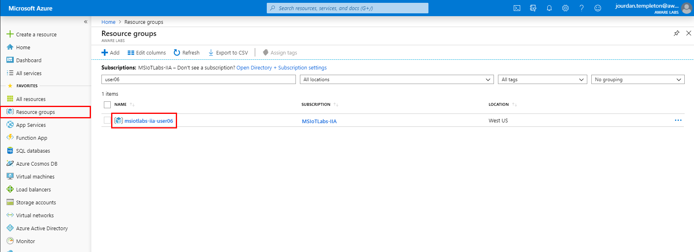
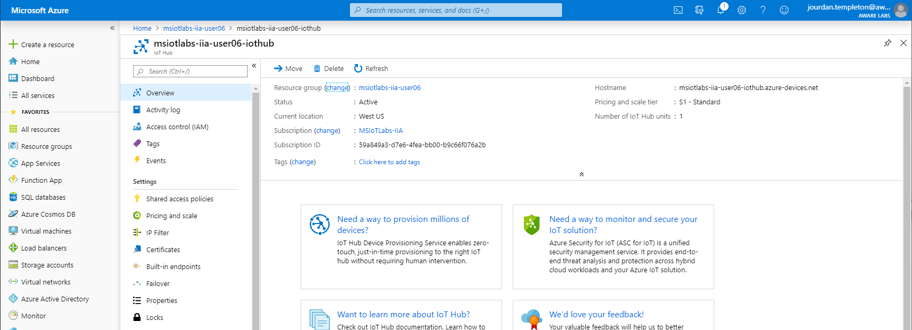
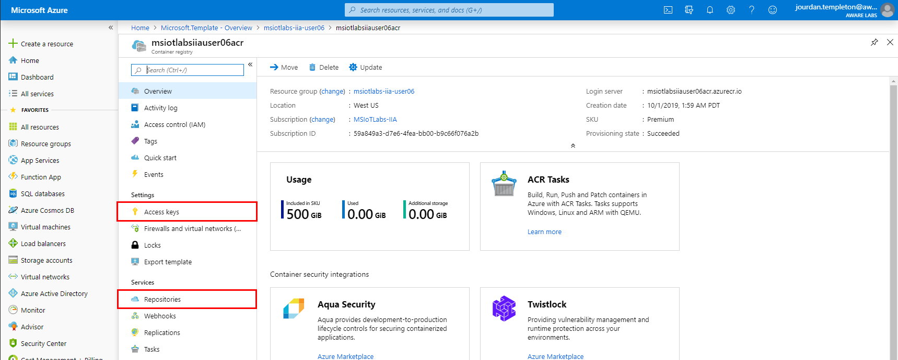

# Lab 03 - Configure your cloud solution platform

## 1 - Deploy and configure Azure IoT components

### 1.1 - Provision Azure Resources

The focal point of all Microsoft IoT solutions is the Azure IoT Hub service. IoT Hub provides secure messaging, device provisioning and device management capabilities.

Azure Resource Manager Templates (ARM Templates) can be deployed into Azure that include IoT Hub. 

1. Click the 'Deploy to Azure' button below to create the Azure IoT components required for the next labs:  

  
You can also visualize an ARM template to see the components that will be created.

2. Choose the Resource Group that matches your lab user number, click 'I agree' on the terms and 'Purchase' to begin the provisioning process.

3. Wait for the provisioning process to complete.

### 1.2 - Validate Resources

1. On the left hand icon menu, click 'Resource Groups'

2. Click on the resource group that corresponds to your username

3. Validate that you can see the following types of resources: 
* Container Registry
* Device Provisioning Service
* IoT Hub
* Storage Account
* Stream Analytics Job

These components represent the IoT platform your device connects to.

## 2 - Explore Resources

### 2.1 - IoT Hub

IoT Hub is the core of all IoT projects in Azure. Click on your IoT Hub resource and explore the different pages (listed below Overview are all the different pages that you will be interested in, these are to the left part of the screen depicting IoT Hub resource (not far left).

1. Click on the Access Policies page, and change it to Shared Access Policies.

|Component Name    |Notes|
|--------|-----|
|Access Policies|IoT Hub has a specific focus on security and this is one of the areas to configure access to the management of the IoT Hub. |
|IoT Devices|This device list allows you to see all the devices that are currently registered against the IoT hub and manage them. You can also check the metadata for each device including their Device Twin.|
|IoT Edge|This is an important component for the labs further on. This allows you to manage your IoT Edge devices in a similar fashion to the IoT Devices.|
|Message Routing|Core to IoT Hub is a messaging platform - the ability to send messages from the Device-to-Cloud and Cloud-to-Device. Message routes allow you to forward device messages to other Azure services. There is a route configured in this solution that allows the telemetry to flow through to Time Series Insights.

**Hint:** In preparation for the next step in the lab, using the breadcrumb trail (at the top middle of the screen) click on **msiotlabs-iia-user##** resource group to take you back to the higher level.

### 2.2 - Device Provisioning Service (DPS)

The Device Provisioning Service is on the same level as the IoT Hub (see Hint in the previous step if stuck).

DPS allows devices to be embedded with an organization specific key, that allows them to register against a specific IoT Hub on first boot. This enables device builders to easily manufacture a fleet of devices and have them register against centrally managed IoT Hubs.

|Component Name    |Notes|
|--------|-----|
|Linked IoT Hubs|DPS has the ability to enrol a device in a specific IoT Hub. You'll notice that the deployed template has connected DPS to the existing IoT Hub.|
|Manage Enrollments|Devices that have enrolled show up in this list. You can check this area again in a future lab.|

**Hint:** Once again for the next step, using the breadcrumb trail (at the top middle of the screen) click on **msiotlabs-iia-user##** resource group to take you back to the higher level.

### 2.3 - Stream Analytics (Edge)

Stream Analytics is a fully managed Platform as a Service (PaaS) offering on Azure, designed to analyze and process high volumes of fast streaming data from multiple sources simultaneously. It is available both in the Cloud and at the Edge.

|Component Name    |Notes|
|--------|-----|
|Query|Stream analytics allows you to write a query that is applied to the data streaming through. In a future lab we will modify this query.|

The Edge version of Stream Analytics allows us to run this service inside a container on our Edge Device. 

**Hint:** Jump back to **msiotlabs-iia-user##** resource group once again in preparation for the next step as you have done previously.

### 2.4 - Container Registry

Container Registry is a private docker container registry that you can push containers to. When combined with IoT Edge, you can store the containers to be used by your edge devices. Your proprietary code can stay protected in your own container registry rather than a public registry.

|Component Name    |Notes|
|--------|-----|
|Repositories|Contains all the repositories with containers and tags currently pushed to the Container Registry.|
|Access Keys|Contains the security keys used for connecting to your Container Registry. We'll return here later.|

## 3 - Explore Common Resources
As part of this lab a set of common resources have been provisioned for all lab users to share. Return to your list of Resource groups and click on the 'common' Resource group.
**Hint:** Use the search bar at the top of Azure and type in "common".

The resources here allow data to flow from all the separate lab IoT Hub instances into a single stream of IoT data which is then consumed and displayed through Time Series Insights.

### 3.1 - Cognitive Services

The Cognitive Services are a collection of pre-trained ML models that can be built into your own applications and services easily. Custom Vision is one of these services.

Custom Vision allows you to leverage the compute infrastructure in Azure to train your own Computer Vision model quickly and easily.

### 3.5 - Time Series Insights

Click on Time Series Insights Environment and then 'Go To Environment' to view the user interface. The data can then be displayed here. You will return to this page to view the results of future lab exercises.

