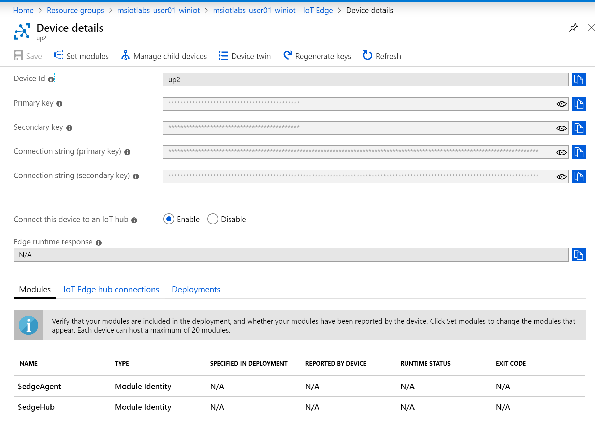

# Lab 04 - Introduction to Azure IoT Edge

This lab introduces Azure IoT Edge with Windows 10 IoT Core.

## 1.0 - Set up your Surface Laptop Device

### 1.1 - Cloud setup

1. Make a note of the Surface Laptop device name printed on the the device. For example, IOTEDGE02 
2. Open a browser and navigate to the [Azure Portal https://portal.azure.com](https://portal.azure.com). Login with the lab credentials provided.
3. Click "**Resource groups**" on the left-hand menu, select the "**winiot**" resource group in the list and choose the IoT Hub created in [Lab 2](./Lab02.md#11---deploy-azure-iot-hub)

4. Click "**IoT Edge**" on the IoT Hub side menu and click "**Add an IoT Edge device**" at the top. **Note: that this is a slightly different menu than the one used earlier in the lab**

1. Enter the Surface Laptop name (from step 2) as the device id and click "**Save**" to create the device
1. Refresh the list and open the device properties
1. Copy "**Connection string (primary key)**" to the clipboard



### 1.1 - Device setup

1. Install the Azure IoT Edge runtime on the device by running the following command and wait for the device to reboot:

```
. {Invoke-WebRequest -useb aka.ms/iotedge-win} | Invoke-Expression; Deploy-IoTEdge
```

2. Re-connect the remote PowerShell session 
3. Configure the Azure IoT Edge runtime with the following command:

```
. {Invoke-WebRequest -useb aka.ms/iotedge-win} | Invoke-Expression; Initialize-IoTEdge
```

4. To validate the Azure IoT Edge runtime installation, use the command:
```
iotedge check
``` 
You may also use this command to debug issues:
```
Get-IoTEdgeLog
```

## 2.0 - Deploy Simulated Temperature Sensor

### 2.1 - Module deployment

1. Close the remote PowerShell and run the following commands on the laptop PowerShell:

```
az extension add --name azure-cli-iot-ext

az login
az iot edge set-modules --device-id [device name] --hub-name [hub name] --content "C:\Labs\Content\src\IoTLabs.IoTEdge\deployment.example.win-x64.json"
```

### 2.2 - Monitor Device to Cloud messages

1. Enter the following command to monitor Device-to-Cloud (D2C) messages being published to the IoT Hub:

```
az iot hub monitor-events -n [hub name] -d [device id]
```
 
## 4.0 - Deploy IoT Edge Modules

### 4.1 - Author a deployment.json file

Now that we have a container image with our inferencing logic stored in our container registry, it's time to create an Azure IoT Edge deployment to our device.

1. Go to "**C:\Labs\Content\src\IoTLabs.IoTEdge**"
1. Edit the "**deployment.template.lab04.win-x64.json**" file
1. Search for any variables starting with ACR and replace those values with the correct values for your container repository. The ACR_IMAGE must exactly match what you pushed, e.g. aiedgelabcr.azurecr.io/customvision:1.0-x64-winent

**Hint: you can type $containerTag to get the full container string from PowerShell.**


### 4.2 - Deploy the IoT Edge deployment.json file. 

Just like the example deployment, use the following syntax to update the expected module state on the device. IoT Edge will pick up on this configuration change and deploy the container to the device.

```
az iot edge set-modules --device-id [device name] --hub-name [hub name] --content "C:\Labs\Content\src\IoTLabs.IoTEdge\deployment.template.lab04.win-x64.json"
```

Run the following command to get information about the modules deployed to your IoT Hub.
```
az iot hub module-identity list --device-id [device name] --hub-name [hub name]
```

### 4.3 - Verify the deployment on IoT device

The module deployment is instant, however changes to the device can take around 5-7 minutes to take effect. On the **target device** you can inspect the running modules with the following command in the remote PowerShell terminal:

```powershell
iotedge list
```

Once the modules have deployed to your device, you can inspect that the module is operating correctly:

```powershell
iotedge logs [container-name]
```


### 4.4 - Monitor Device to Cloud messages

1. Switch back to your development machine
1. Enter the following command in powershell to monitor Device-to-Cloud (D2C) messages being published to the IoT Hub, you should see the events change as you move the camera to face the up2 device.

```
az iot hub monitor-events -n [hub name] -d [device id]
```
