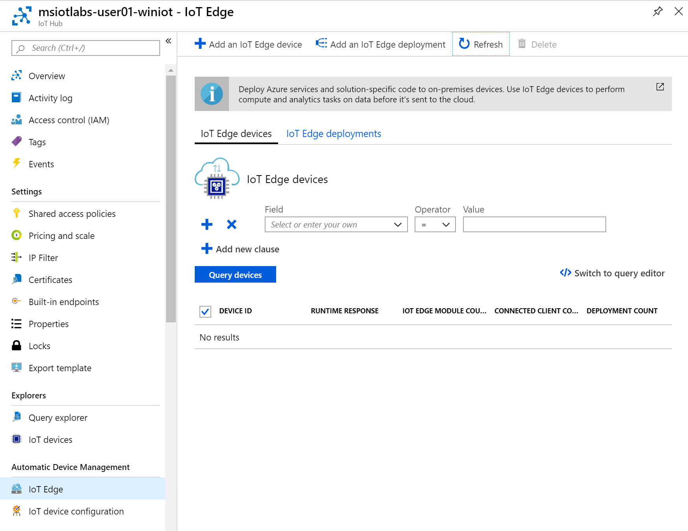

# Lab 04 - Introduction to Azure IoT Edge

## 1.0 - Set up your UP Squared Device

1. Plug the HDMI cable from the Dragonboard into the UP Squared Device.
1. You should see information about the device, including the device name and IP Address. You will need this to connect to the device via the IoT Dashboard
1. Next open the Azure Portal and Sign in
1. Click "Resource groups" on the left-hand menu, select the "winiot" resource group in the list and choose the IoT Hub previously created
1. Click "IoT Edge" on the IoT Hub side menu and click "Add an IoT Edge device" at the top. Note that this is a slightly different menu than the one used earlier in the lab.

1. Enter the device name as the Device ID and click "Save" to create the device
1. Click the newly saved device (you may need to refresh) and copy the "Connection string (primary key)" field to the clipboard - we will use this later


### 1.1 - Set up IoT Edge

1. Remotely connect to powershell on the device, by opening the IoT Dashboard then clicking on the three dots in the "Actions" column and then clicking "Launch Powershell". When prompted,enter "p@ssw0rd" as the password.

2. Type in the following to the console and wait for the operation to complete, the machine will restart during this process and you will need to reconnect to the devices's powershell.

```
. {Invoke-WebRequest -useb aka.ms/iotedge-win} | Invoke-Expression; Deploy-IoTEdge
```

3. After the IoT Edge agent has been installed we can connect it up to our IoT Hub by supplying the connection string you retreived earlier.

```
. {Invoke-WebRequest -useb aka.ms/iotedge-win} | Invoke-Expression; Initialize-IoTEdge
```

4. You can check that IoT Edge has installed correctly by typing "iotedge check" and viewing the output. The command "Get-IoTEdgeLog" may also assist in troubleshooting any issues that occur.

## 2.0 - Deploy the mock temperature sensor monitor deployment

```
az login
az iot edge set-modules --device-id [device name] --hub-name [hub name] --content "C:\Labs\Content\src\IoTLabs.IoTEdge\deployment.example.json"
```

### 2.1 - Monitor Device to Cloud messages

```
az extension add --name azure-cli-iot-ext
az iot hub monitor-events -n [hub name] -d [device id]
```
 
## 3.0 Build and deploy a custom model that detects UP Squared Devices

### 3.1 Set up and deploy Azure Container Registry

[Quickstart: Create a private container registry using the Azure portal](https://docs.microsoft.com/en-us/azure/container-registry/container-registry-get-started-portal)

1. Sign into the Azure Portal
1. Create a new "Container Registry" resource
1. Once created, switch to the "Access Keys" pane.
1. Enable the "Admin User"
1. Make note of the Login Server, username, and password. You'll need these later.


### 3.2 Build & Test the sample
Next we will build and deploy our own container.

1. Open a powershell window at this location "C:\Labs\Content\src\IoTLabs.CustomVision"
2. Restore the packages by running the following command

```
dotnet restore -r win-x64
```

3. Connect the camera to your laptop and point the camera at the Up Squared
4. Run the sample locally to classify the object. This will test that the app is running correctly locally. We specify "Lifecam" for this model of camera. Here we can see that a "up2" has been recognized.

```
dotnet run --model=CustomVision.onnx --device=LifeCam
4/24/2019 4:09:04 PM: Loading modelfile 'CustomVision.onnx' on the CPU...
4/24/2019 4:09:04 PM: ...OK 594 ticks
4/24/2019 4:09:05 PM: Running the model...
4/24/2019 4:09:05 PM: ...OK 47 ticks
4/24/2019 4:09:05 PM: Recognized {"results":[{"label":"up2","confidence":1.0}],"metrics":{"evaltimeinms":47,"cycletimeinms":0}}
```

### 3.3 - Containerize the sample app 

1.  Publish the executables into a folder named release by running the following command
```
dotnet publish -c Release -o ./release -r win-x64
```
2. Then enter the name of your container (note: the number value after the colon denotes the version, increment this every time you make a change)
```powershell
#SAMPLE: customvision:1.0-x64-iotcore
$imageName = "[container-name]"
#SAMPLE: aiedgelabcr
$registryName = "[azure-container-registry-name]"
docker build . -t "$registryName.azurecr.io/$container"
```


### 3.4 - Authenticate and push to Azure Container Registry

- Authenticate to the Azure Container Registry and push the new image that was built in the previous step.

```powershell
az acr login --name $registryName
docker push $imageName
```

## 4.0 - Deploy edge modules to device 

### 4.1 - Author a deployment.json file

Now that we have a container image with our inferencing logic stored in our container registry, it's time to create an Azure IoT Edge deployment to our device.

1. Go to "C:\Labs\Content\src\IoTLabs.IoTEdge"
1. Edit the "deployment.template.win-x64.json" file
1. Search for "{ACR_*}" and replace those values with the correct values for your container repository. The ACR_IMAGE must exactly match what you pushed, e.g. aiedgelabcr.azurecr.io/customvision:1.0-x64-iotcore


### 4.2 - Deploy the IoT Edge deployment.json file. 

Just like the example deployment, use the following syntax to update the expected module state on the device. IoT Edge will pick up on this configuration change and deploy the container to the device.

```
az iot edge set-modules --device-id [device name] --hub-name [hub name] --content "C:\Labs\Content\src\IoTLabs.IoTEdge\deployment.template.win-x64.json"
```

Run the following command to get information about the modules deployed to your IoT Hub.
```
az iot hub module-identity list --device-id [device name] --hub-name [hub name]
```

### 4.3 - Verify the deployment on IoT device

The module deployment is instant, however changes to the device can take around 5-7 minutes to take effect. On the **target device** you can inspect the running modules with the following command in the remote PowerShell terminal:

```powershell
iotedge list
```

Once the modules have deployed to your device, you can inspect that the module is operating correctly:

```powershell
iotedge logs [container-name]
```
