# Lab 06 - Turn your device into a locked down kiosk

## Common Setup Steps

### Install the certificate

1. Navigate to `C:\Labs\content\src\IoTLabs.TestApp\IoTLabs.TestApp`
2. Open the file named **IoTLabs.pfx**
3. Select **Local Machine**, then click **Next**
   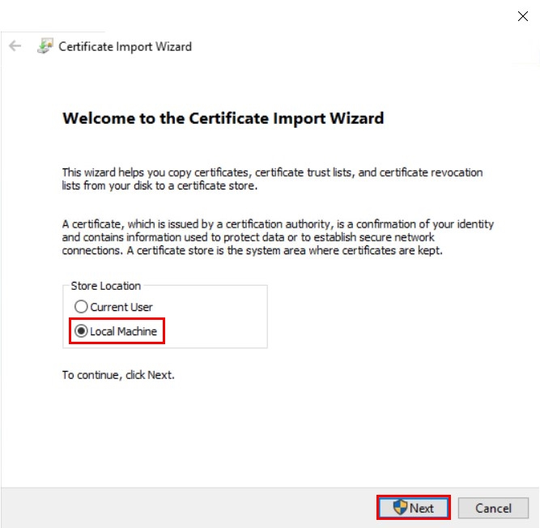
4. When prompted by UAC, select **Yes**
   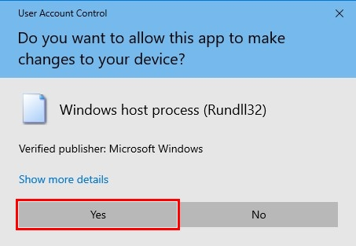
5. Leave the settings as default and click **Next**
   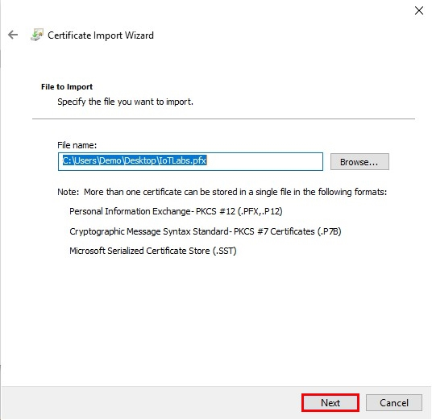
6. Leave the settings as default and click **Next**
   
7. Select **Place all certificates in the following store**, then click **Browse...**
   
8. Select **Trusted Root Certification Authorities** and click **Ok**
   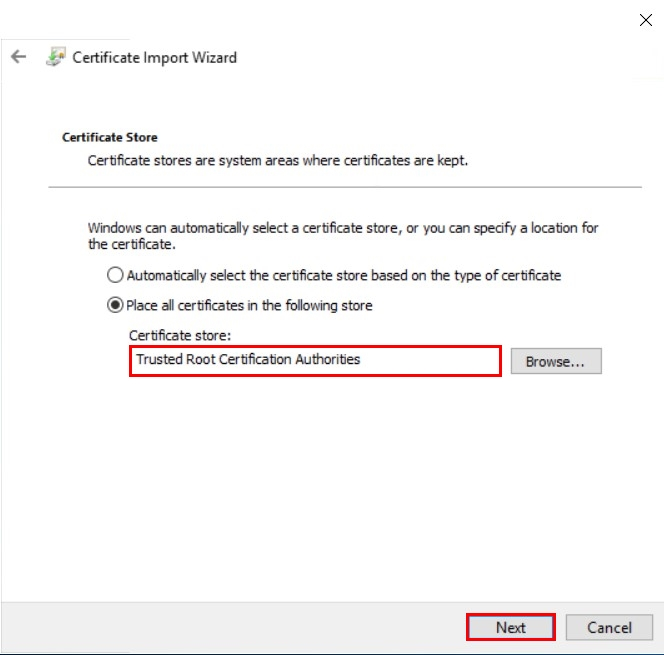
9. Click **Next**, then click **Finish**
   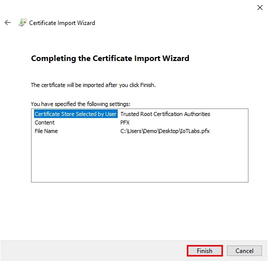

### Build the UWP Application that we will be using for assigned access

1.	Open up the lab project found in `C:\Labs\content\src\IoTLabs.TestApp\IoTLabs.TestApp.sln`
2.	Right click on the project **IoTLabs.TestApp (Universal Windows)** and click **Publish**, then **Create App Packages...**
   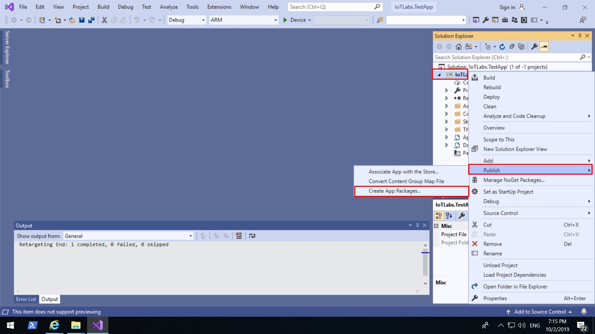
3.	Select **Sideloading**, then click **Next**
   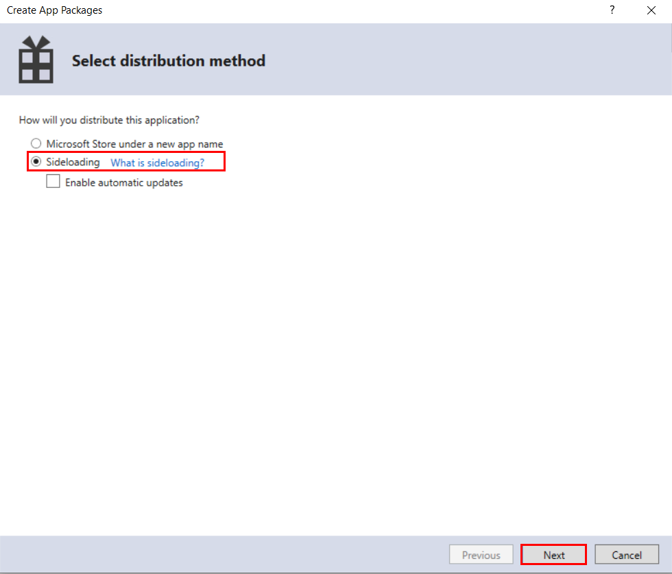
4.	Click **Remove**, then **Select From File** 
   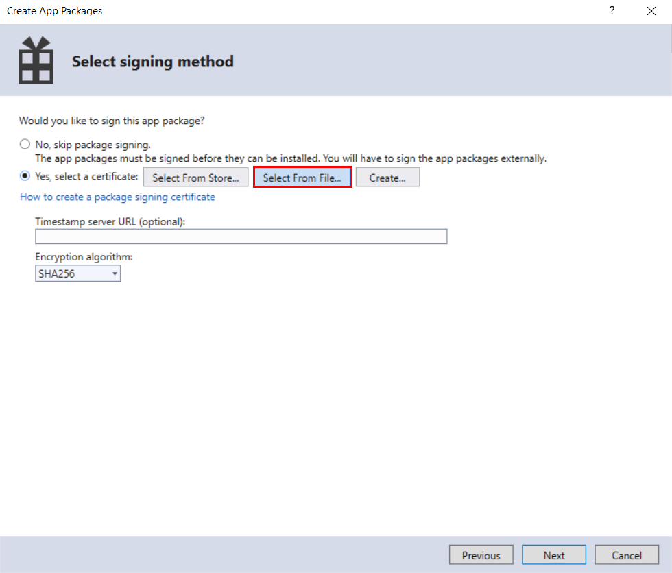
5.  Select **IoTLabs.pfx**,
   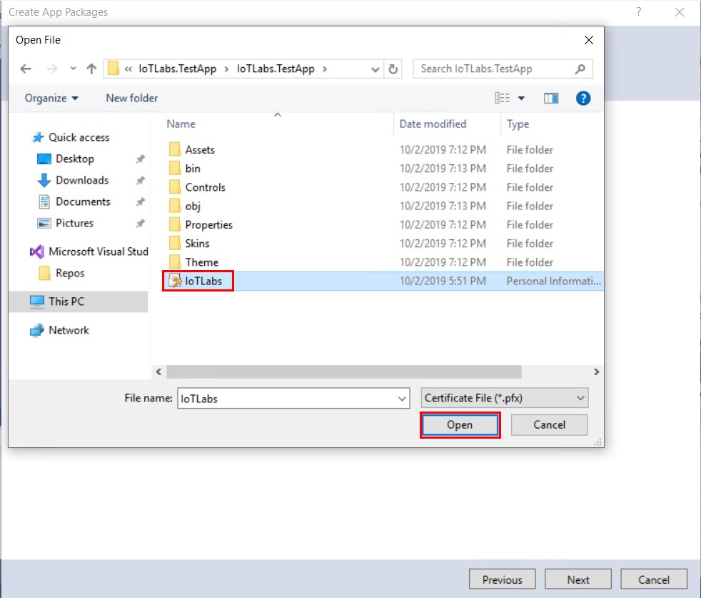
5.  Then click **Next**
   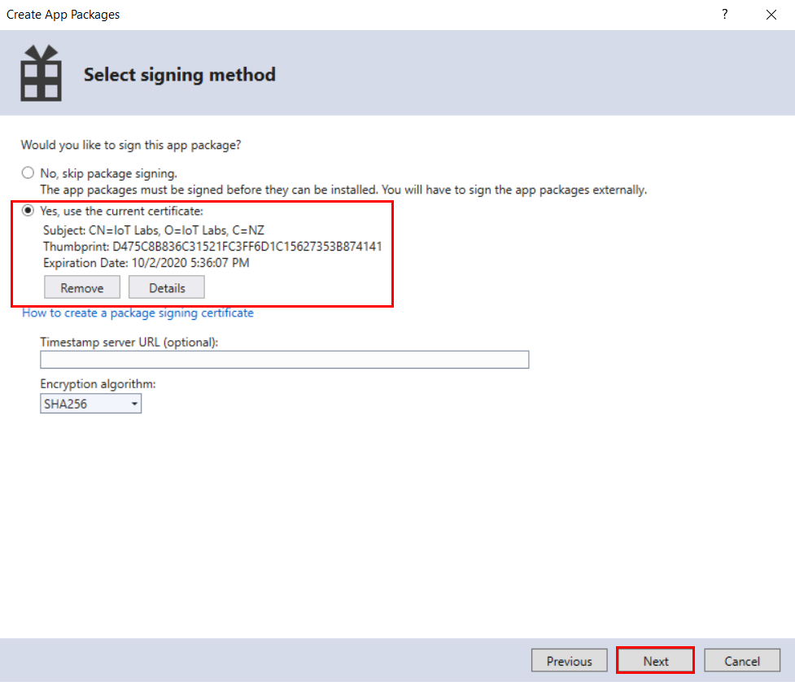
5.	Make sure only **x86** and **ARM** are selected then click **Create**
   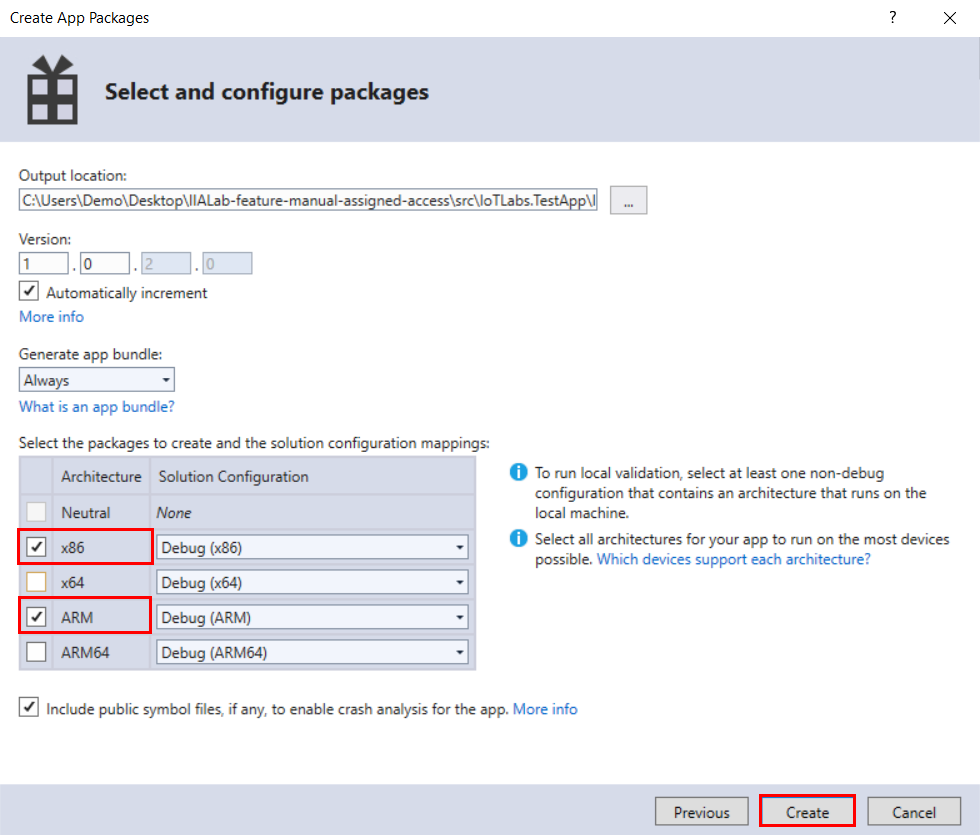
6.	Wait for the publish to finish, then click on the **Output location** link
   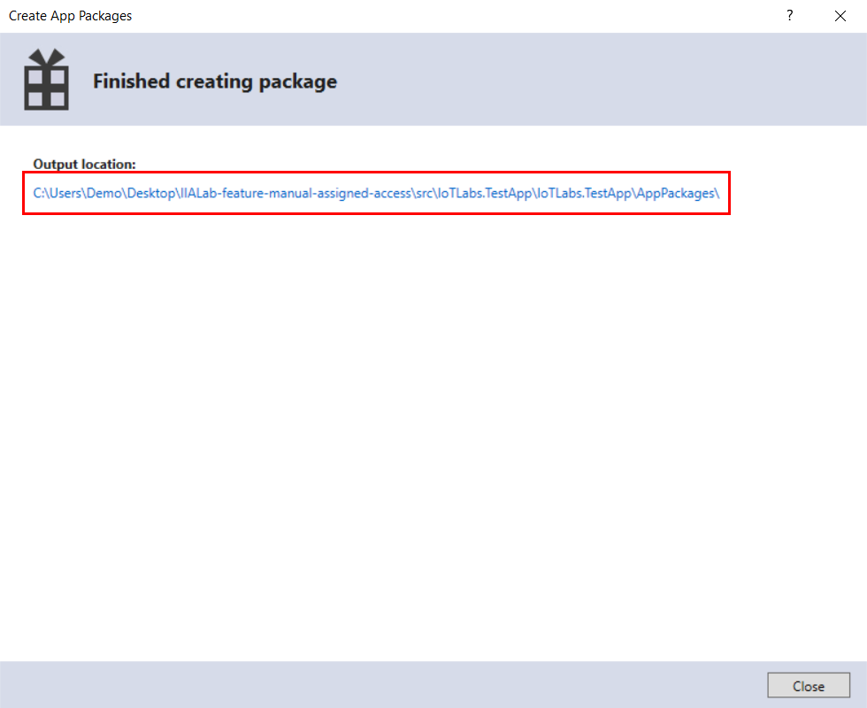
7.	Open **IoTLabs.TestApp_1.0.2.0_Debug_Test** folder, right click on **install.ps1** and click **Run with PowerShell**
   

## Option 1 - Using Settings to set up Assigned Access

You can use **Settings** on the local device to quickly configure one or a few devices as a kiosk. 

### Configure Assigned Access
1.  Go to **Start** > **Settings** > **Accounts** > **Other users**
   
2.  Select **Set up a kiosk > Assigned access**, and then select **Get started**
3.  When prompted set the Kiosk users name to **Kiosk**
   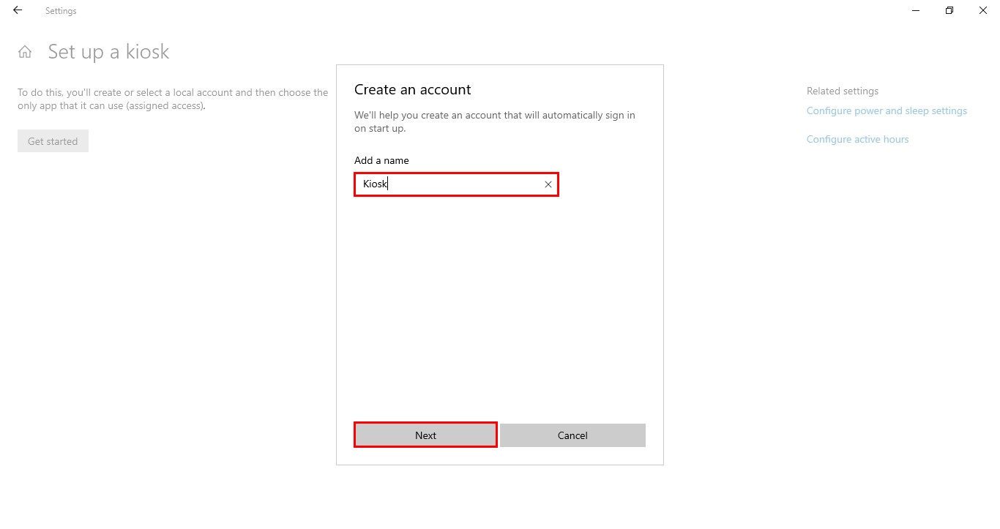
4.  When prompted to select an Application, select **IoTLabs.TestApp**
   
5.  Select **Close**
   
6.  Restart the device

### Remove Assigned Access
1. Push **Ctrl + Alt + Delete**
2. Switch user into your administrative account
3. Go to **Start** > **Settings** > **Accounts** > **Other users**
4. Select **Set up a kiosk**
3. Select the **Kiosk** users tile and then select **Remove kiosk**

## Option 2 - Using a Provisioning Package to set up Assigned Access

You can use **Provisoning Packages** to quickly and consistently deploy settings to a fleet of devices. This can be done either during OOBE or after the device has been set up.

### Install

1. Go to `C:\Labs\Content\src\IoTLabs.AssignedAccess\`
2. Open the ppkg file `lab06.ppkg`, this is the provisoning package that holds all the settings and files required to deploy
3. When prompted click **Yes, add it**

4. Restart your computer
5. Your device should auto login as the locked down Kiosk user

### Removing the provisioning package 

1. Push **Ctrl + Alt + Delete**
2. Switch user into your administrative account
3. Go to **Start** > **Settings** > **Accounts** > **Access work or school** > **Add or remove a provisioning package**
   
4. Select the provisoning package and then select **Remove**
   

